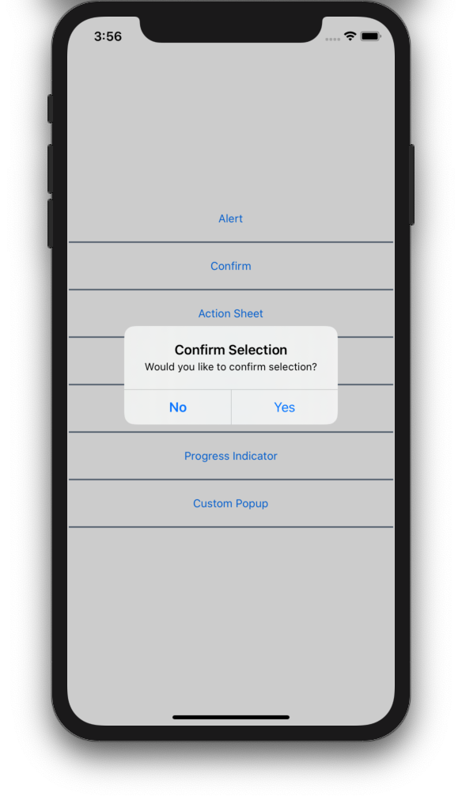
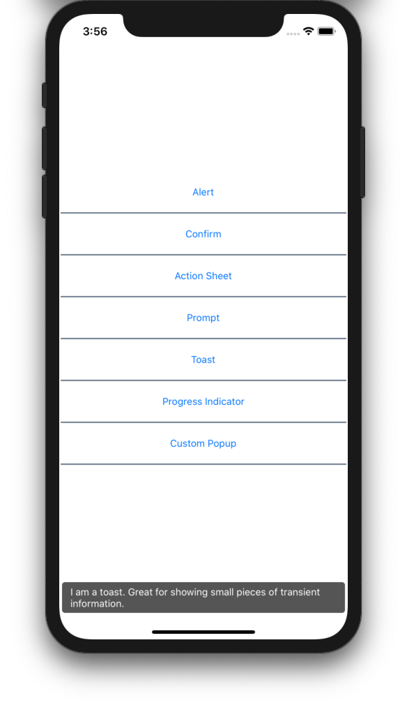
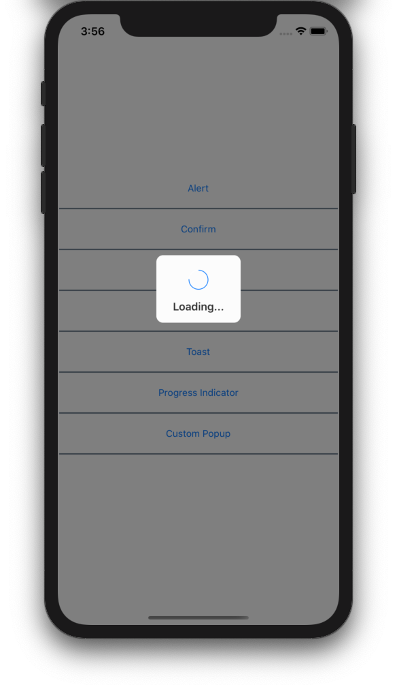

# A Beginners Guide To Dialogs In Xamarin.Forms
An introduction to the various dialogs that we can use in a Xamarin.Forms app.

## Introduction

When developing mobile applications, dialogs are a foundational building block in our tool-belt. We can use dialogs to show a confirmation message, to indicate when the app is working or even to create a rich input form that appears over our main user interface.

This article is an introduction on how to use dialogs in Xamarin.Forms and is intended to be a beginners guide. I aim to introduce the core concepts and terminology on dialogs, get you started with the most current dialog frameworks and to provide a quick reference on how to use the main dialog types.

Before we dive into using dialogs, let's take a moment to introduce some important terminology that I will use throughout this article:

 * **Modal**: The dialog appears over the existing user interfaes and blocks input to the elements beneath it. Modal dialogs effectively "focus" the users attention onto the dialog.
 * **Transient**: A transient dialog is temporary and dismisses by itself without user intervention. For example, dialogs that automatically dismiss after a specified time span are transient.

Next

 * [Alerts](#alerts): A dialog that shows a message.
 * [Prompts](#prompts): A dialog that requests input from a user.
 * [Action Sheets](#action-sheets): A list of choices presented to a user.
 * [Toast](#toasts): A small, unobtrusive message that shows for a small amount of time.
 * [Activity Indicator](#activity-indicators): A dialog to indicate that our app is working.
 * [Custom Popups](#custom-Popups): A modal dialog with fully customised content.

The full source code for this

## Packages And Frameworks

While Xamar

 * Acr.UserDialogs: A rich dialogs library for Xamarin.Forms. Acr.User dialogs is the de-factor standard when working with dialogs in Xamarin.Forms.
    * [Getting Start Guide]();
 * Rg.Popups: Create fully customised popups and modal dialogs using Xamarin.Forms pages.
    * [Getting Start Guide](https://github.com/rotorgames/Rg.Plugins.Popup/wiki/Getting-started)


## Terminology

One important

 * [Alerts](#alerts): A dialog that shows a message.
 * [Prompts](#prompts): A dialog that requests input from a user.
 * [Action Sheets](#Action-Sheets): A list of choices presented to a user.
 * [Toast](#Toasts): A small, unobtrusive message that shows for a small amount of time.
 * [Activity Indicator](#Activity-Indicators): A dialog to indicate that our app is working.
 * [Custom Popups](#Custom-Popups): A modal dialog with fully customised content.

Terminology:


## Dialogs 101

### Alerts

An **Alert** is a modal dialog used to show a message to a user.


Alert dialogs are a convenient

Using Acr.UserDialogs, we would show an alert like so:

```
Acr.UserDialogs.UserDialogs.Instance.Alert("Welcome to aler", "Ok");
```

Some common use cases

A special kind of alert dialog is a **Confirm** dialog, an alert that display a message with a choice of two or more actions.



Confirm dialogs are used to force a user to double check

**Showing a confirmation**
Short tutorial on how I show an alert with Acr user dialogs

Include image.

### Prompts

An **Prompt** is a modal dialog that notifies the use


**Using a prompt**

### Action Sheets

An **Action Sheet** is a popup dialog that present the user with a selection of item and, optionally, a cancel and destructive action.


What is an action sheet? Why would I use one?

 -> A modal dialog that presents a list of selections.

Short tutorial on how I show an action sheet with Acr user dialogs

Include image.

### Toasts

A **Toast** is a small, temporary popup that shows at the bottom of the screen useful for display displaying small and unobtrusive messages. Toasts are effectively transient dialogs



For example:

To

A source code sample

### Progress

What is a progress indicator and why would I use it?



 -> A modal dialog that display an activity indicator. Can use it to

### Custom Popup

What is a custom popup and why would I use it?


 -> A modal pop

Very short tut

## Summary

Recap each dialog kind and what they do.

Put a call to action to sponsor Acr Userdialogs and Rg.Popups
